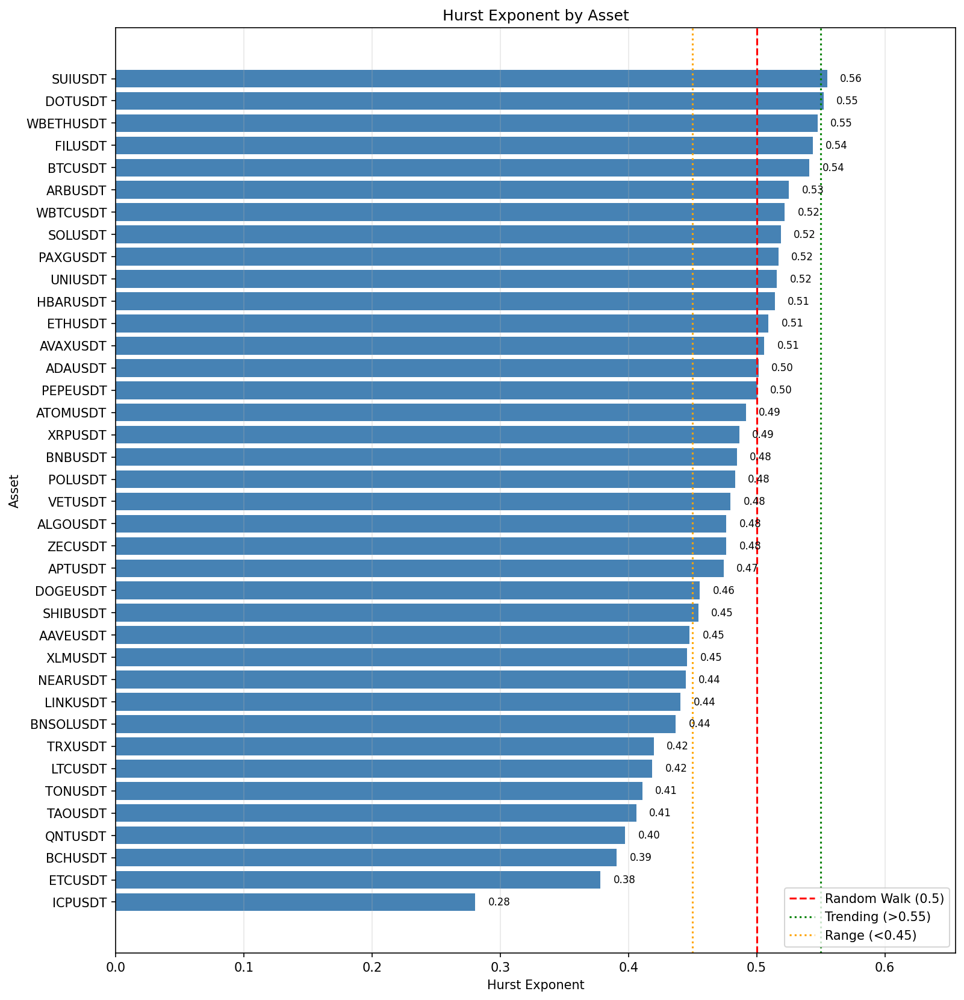

# Hurst Crypto (Binance)

This project computes Hurst exponents for top crypto assets using Binance daily (or other interval) data.
The project includes a cache-aware downloader with gap detection and a separate analysis
script that reads only cached data.

The Hurst exponent is a statistic that describes long-term memory in a time series:
values above 0.5 suggest persistence (trend-following), values below 0.5 suggest
anti-persistence (mean-reversion), and 0.5 is consistent with a random walk.

## Files
- `binance_data.py`: Downloads and caches Binance klines with gap filling and rate limiting.
- `hurst_binance.py`: Computes Hurst exponents from cached data and saves plots.
- `config.json`: Runtime configuration (symbols count, interval, rate limits, etc).

## Requirements
Install Python packages:
```
pip install numpy pandas matplotlib requests
```

## Configuration (`config.json`)
Example:
```json
{
  "num_cryptos": 50,
  "data_dir": "data",
  "start_date": "2018-01-01",
  "interval": "1d",
  "rate_limit_seconds": 0.2,
  "download_concurrency": 5
}
```

Notes:
- `num_cryptos` is used to select the top assets by market cap (excluding stablecoins).
- `start_date` is used for both download and analysis.
- `interval` is a Binance kline interval (e.g., `1d`, `4h`, `1h`).
- `rate_limit_seconds` enforces minimum delay between API calls.
- `download_concurrency` controls how many symbols download in parallel.
- If you add `"symbols": ["BTCUSDT", "ETHUSDT"]`, it overrides auto-selection.

## Download data (cache fill)
This fetches top assets and fills gaps while respecting rate limits:
```
python .\binance_data.py
```

Optional overrides:
```
python .\binance_data.py --top 20 --interval 4h --concurrency 2
```

## Run Hurst analysis (cache-only)
`hurst_binance.py` never downloads; it reads the cached data in the requested range:
```
python .\hurst_binance.py
```

Plots are saved under `plot/` by default.

Example output:
<p>
  
</p>
<p>
  
</p>

## Logging
Enable or disable verbose logs:
```
set HURST_VERBOSE=1
```

## Plot display
By default plots are saved. To show plots interactively:
```
set HURST_SHOW_PLOTS=1
```

Optional override output folder:
```
set HURST_PLOT_DIR=plot
```
