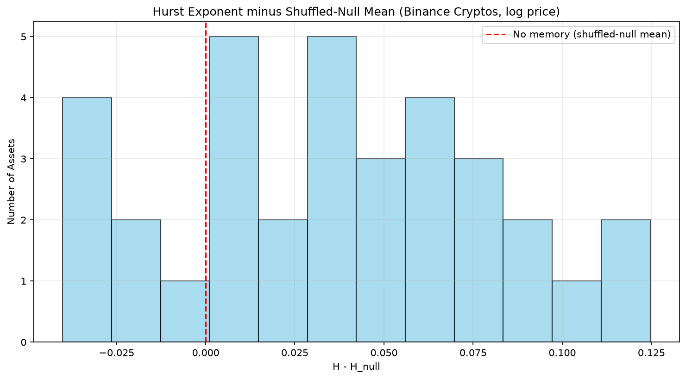
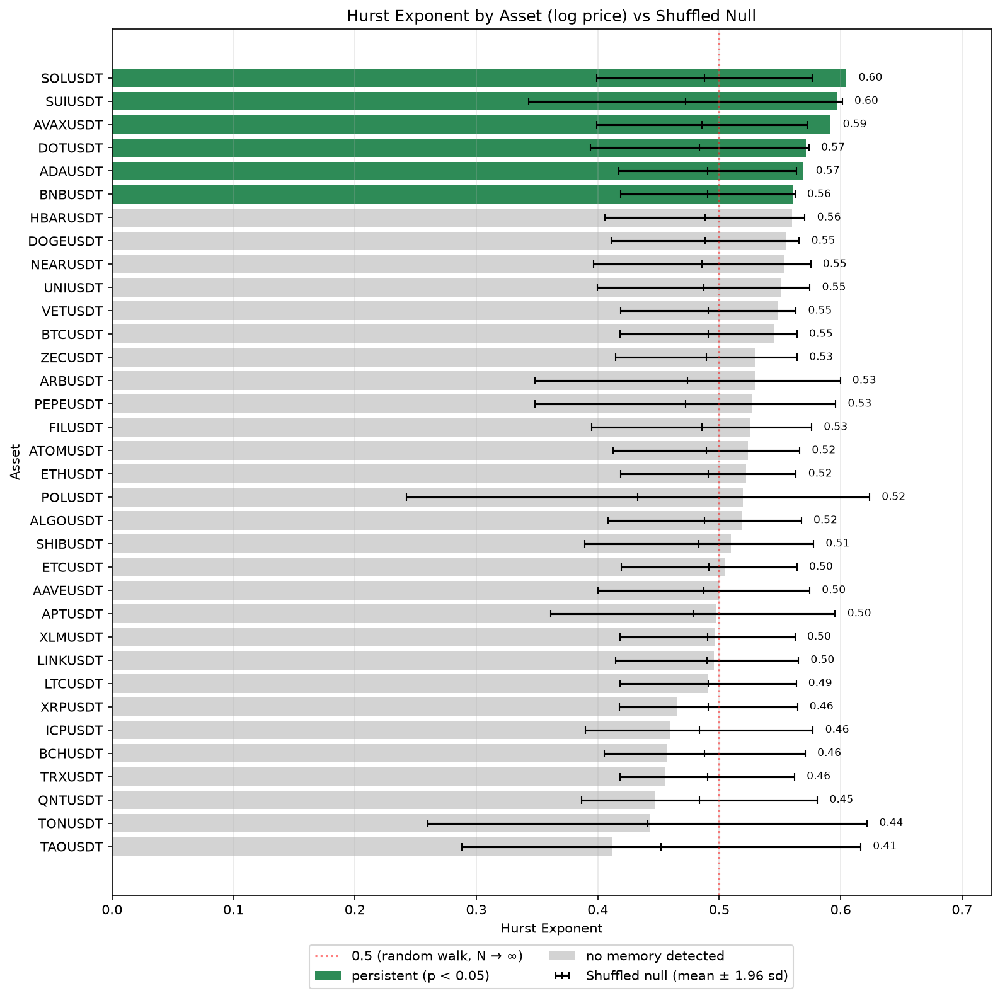

# Hurst Crypto (Binance)

This project computes Hurst exponents for top crypto assets using Binance daily (or other interval) data.
The project includes a cache-aware downloader with gap detection and a separate analysis
script that reads only cached data (no network).

The Hurst exponent is a statistic that describes long-term memory in a time series:
values above 0.5 suggest persistence (trend-following), values below 0.5 suggest
anti-persistence (mean-reversion), and 0.5 is consistent with a random walk.

## Files
- `hurst.py`: Hurst estimator and shuffled-null significance test (+ self-check).
- `binance_data.py`: Downloads and caches Binance klines with gap filling and rate limiting.
- `hurst_binance.py`: Computes Hurst exponents from cached data and saves plots and a results table.
- `config.json`: Runtime configuration (symbols count, interval, rate limits, etc).

## Requirements
Install Python packages:
```
pip install numpy "pandas>=2.2" matplotlib requests
```

## Method
- **Variable:** log close price. Raw prices let the most expensive periods dominate.
  For example, ICP's post-listing crash gave H=0.28 on raw price and 0.46 on log price.
- **Estimator** (`hurst.py`): the spread of price changes grows with lag as
  `std(x[t+lag] - x[t]) ~ lag**H`, so H is the slope of log(std) vs log(lag),
  over lags 2-99 **candles**. With `1d` data that means 2-99 days. With `4h` data it
  means 8 hours to 16 days, which is a different physical time scale.
  This is a variance-of-increments estimator, not R/S.
- **Why not compare with 0.5:** for finite series this estimator is biased low even for
  a pure random walk (about 0.42 at N=400, 0.47 at N=1000, 0.49 at N=2900), and its
  scatter is 0.04-0.12. Fixed thresholds such as 0.45/0.55 therefore mostly sort noise.
- **Null test:** for each asset, its own daily returns are shuffled 2000 times and H is
  recomputed. Shuffling keeps the length, the fat-tailed return distribution and the total
  drift, and destroys only the time ordering. The verdict is `persistent` or
  `anti-persistent` if the two-sided permutation p < 0.05, otherwise `no memory detected`.
- **Self-check:** `python hurst.py` recovers known H (0.3 and 0.7) from synthetic
  fractional Gaussian noise. It flags about 5% of pure random walks, and it detects
  real memory on the correct side.

## Universe
- The analysis uses `config.json` `"symbols"` if set, otherwise every CSV in `data_dir`.
- The downloader's market-cap ranking excludes:
  - stablecoins;
  - tokenized stocks (Binance tag `bStocks`) and commodity tokens (`tCommodities`, e.g. PAXG);
  - wrapped/staked copies of another coin (WBTC, WBETH, BNSOL; their daily return
    correlation with BTC/ETH/SOL is ≥ 0.998).
- The universe is "today's large caps", so it is biased toward past winners.
- Crypto assets co-move (median pairwise return correlation ≈ 0.6), so 34 assets are far
  fewer than 34 independent tests.

## Results (cached snapshot 2018-01-01 → 2026-01-01, daily, 34 assets)
- **Persistent at p < 0.05:** 6 of 34 assets — SOL, AVAX, ADA, SUI, DOT, BNB. Chance alone would give about 1.7.
- **Borderline:** DOT and BNB have p ≈ 0.04–0.05.
- **Anti-persistent:** none.
- **Position relative to the null:** 27 of 34 assets are above their own null mean (median H − H_null = +0.04).
- **BTC and ETH:** 0.55 and 0.52; neither is significant.
- **Previous "range-bound" labels:** from the raw-price version (ICP, ETC, …), they do not survive. ICP is 0.46 against a null of 0.48 (p=0.59).
- **Reading:** weak trend-following at 2–99 day scales in part of the market, consistent with bull/bear regimes. No mean reversion is detected.

<p>
  
</p>
<p>
  
</p>

## Configuration (`config.json`)
Example:
```json
{
  "num_cryptos": 50,
  "data_dir": "data",
  "start_date": "2018-01-01",
  "interval": "1d",
  "rate_limit_seconds": 0.2,
  "download_concurrency": 5,
  "min_history_days": 365
}
```

Notes:
- `num_cryptos` is the number of top assets by market cap the downloader fetches.
- `start_date` is used for both download and analysis.
- `interval` is a Binance kline interval that divides a day: `1m`, `3m`, `5m`, `15m`,
  `30m`, `1h`, `2h`, `4h`, `6h`, `8h`, `12h`, `1d`. `3d`/`1w`/`1M` are rejected.
- `min_history_days` skips assets with a shorter cached history. The null band shows how
  uncertain short series still are (TON, POL, TAO).
- `rate_limit_seconds` enforces minimum delay between API calls.
- `download_concurrency` controls how many symbols download in parallel.
- If you add `"symbols": ["BTCUSDT", "ETHUSDT"]`, it overrides auto-selection.

## Download data (cache fill)
This fetches top assets and fills gaps while respecting rate limits.
The still-open current candle is never stored.
```
python .\binance_data.py
```

Optional overrides:
```
python .\binance_data.py --top 20 --interval 4h --concurrency 2
```

## Run Hurst analysis (cache-only)
`hurst_binance.py` never touches the network; it reads the cached data in the requested range:
```
python .\hurst_binance.py
```

Plots and `hurst_results.csv` are saved under `plot/` by default.

## Logging
Verbose logs are on by default. To silence them:
```
set HURST_VERBOSE=0
```

## Plot display
By default plots are saved. To show plots interactively:
```
set HURST_SHOW_PLOTS=1
```

Optional override output folder:
```
set HURST_PLOT_DIR=plot
```
